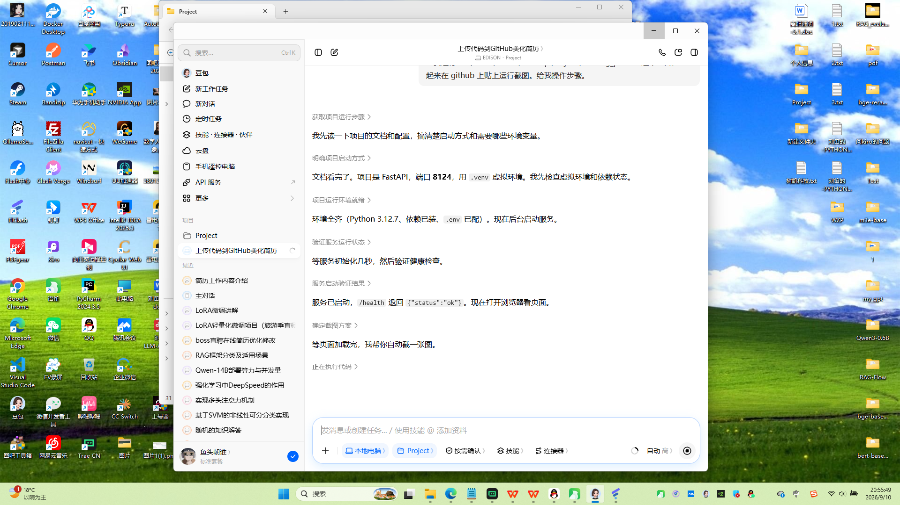

# meeting_parser · 会议纪要智能文书生成工具

上传会议纪要（TXT / DOCX），调用大模型自动生成两份 Word 文书：

- **合规计划书**：根据会议讨论内容，梳理用工、社保、规章制度等方面的合规要点
- **文书清单**：按八大类用工合规场景，列出本次会议涉及的具体法律文书

后端基于 **FastAPI + SSE 流式输出**，前端是原生 HTML 单页，生成过程实时可见。

## 功能特性

- 📄 支持上传 `.txt` / `.docx` 会议纪要，自动去除时间戳
- ⚡ SSE 流式生成，打字机效果实时输出，无需等待整段完成
- 📝 生成结果可直接**下载为 Word（.docx）**，套用参考模板排版
- 🔌 LLM 接口走 OpenAI 兼容协议，可一键切换任意模型供应商
- 🪶 零外部依赖服务：不需要数据库、不需要对象存储，本地一键跑

## 界面截图

<!-- 运行截图放在 docs/screenshot.png，首次使用后请替换 -->



## 快速开始

### 1. 申请免费 LLM API Key

本项目默认使用**智谱 GLM-4-Flash**，注册即送、国内直连、对个人开发者免费：

1. 打开 <https://open.bigmodel.cn/> 注册账号
2. 进入「控制台」→「API Keys」→ 创建新的 API Key
3. 复制这串 Key，下一步填到 `.env` 里

> 也可以换成 DeepSeek / 通义千问 / Moonshot / OpenAI 等任意 OpenAI 兼容接口，改 `.env` 里三个变量即可。

### 2. 配置环境变量

```powershell
cd meeting_parser
copy .env.example .env
```

编辑 `.env`，把刚才申请的 Key 填进去：

```env
LLM_BASE_URL=https://open.bigmodel.cn/api/paas/v4
LLM_API_KEY=你刚才复制的Key
LLM_MODEL=glm-4-flash
```

### 3. 安装依赖并启动

```powershell
python -m venv .venv
.venv\Scripts\Activate.ps1
pip install -r requirements.txt
python main.py
```

启动后浏览器访问：

```
http://127.0.0.1:8124/
```

## 技术栈

| 层 | 技术 |
|---|---|
| 后端 | Python 3.11+ / FastAPI / Uvicorn |
| 大模型 | OpenAI 兼容 SDK（默认智谱 GLM-4-Flash） |
| Word 生成 | python-docx |
| 前端 | 原生 HTML + SSE EventSource |
| 文件解析 | python-docx（DOCX 提取） |

## 项目结构

```
meeting_parser/
├── main.py                # FastAPI 入口：上传 / 流式生成 / 下载 Word
├── workflow.py            # 串行生成流程：合规计划书 → 风险事实 → 文书清单
├── llm_client.py          # OpenAI 兼容客户端封装
├── config.py              # 从 .env 读取 LLM 配置
├── prompts.py             # 各阶段 Prompt 模板
├── document_selection.py # 八大类文书、固定说明、计数规则
├── docx_exporter.py       # 将文本渲染为 Word，套用参考模板
├── templates.py           # Word 样式辅助
├── download_utils.py      # 上传文件内容提取（TXT/DOCX）
├── static/
│   └── index.html         # 单页调试前端
├── reference_templates/   # Word 样式参考模板
└── requirements.txt
```

## 接口说明

| 方法 | 路径 | 说明 |
|---|---|---|
| `POST` | `/api/upload` | 上传 TXT/DOCX 会议纪要，返回 `session_id` |
| `POST` | `/api/generate/stream` | SSE 流式生成两份文书 |
| `GET` | `/api/result/{session_id}` | 查询生成结果文本 |
| `GET` | `/api/download/{session_id}/{doc_index}` | 下载 Word（`doc_index=1` 合规计划书 / `2` 文书清单） |
| `GET` | `/health` | 健康检查 |

## 数据与隐私说明

- 上传的会议纪要文本会发送到你在 `.env` 里配置的 LLM 接口用于生成内容
- 生成的 Word 文件在本地临时生成，浏览器下载后即删除，**不会上传到任何云存储**
- 所有状态保存在进程内存中，服务重启后清空，不写数据库

## License

MIT
